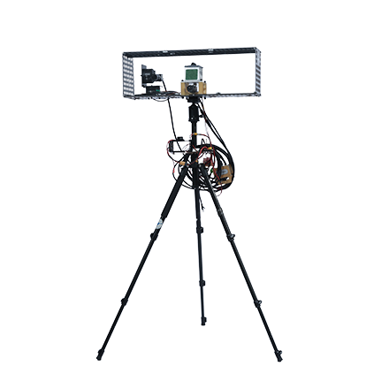
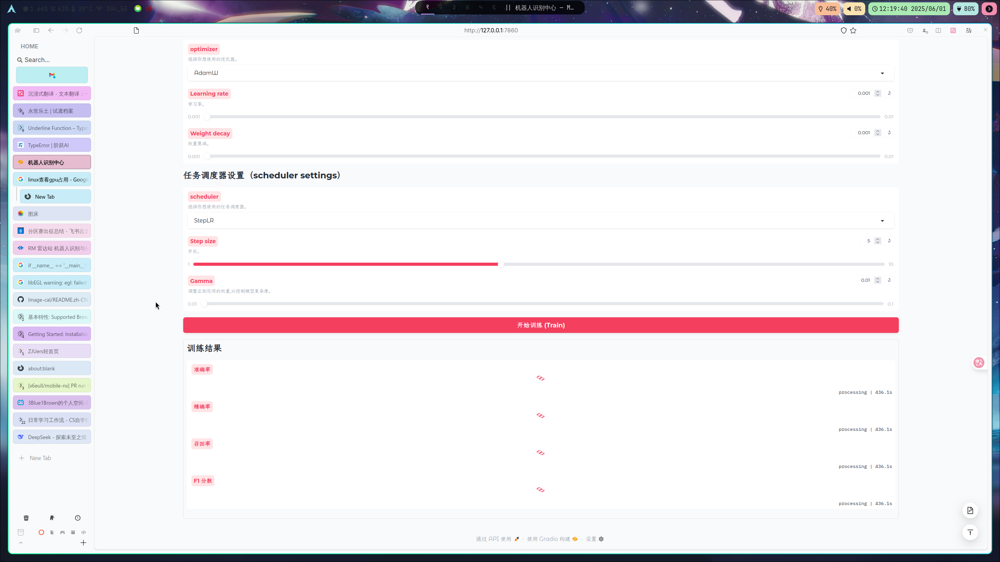
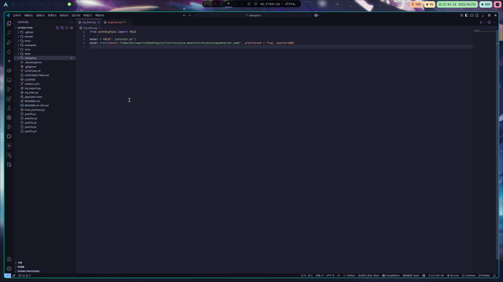
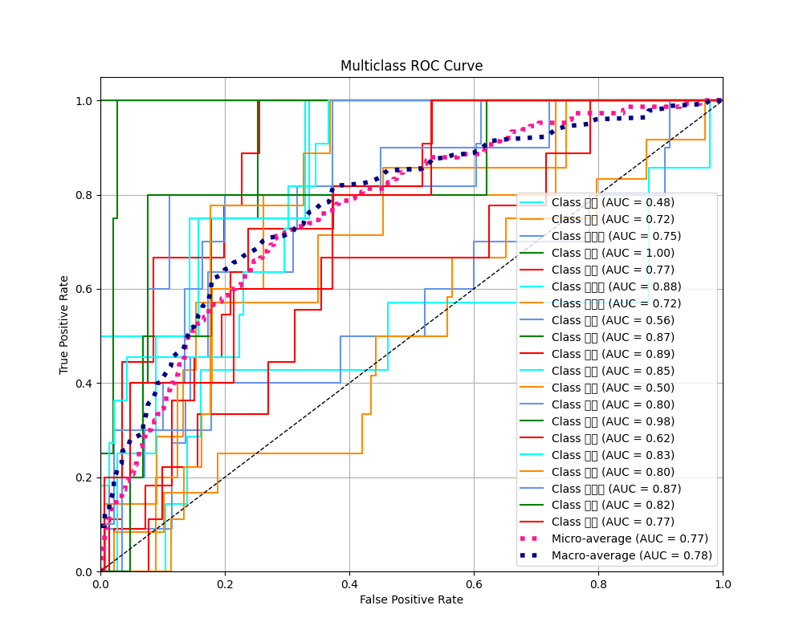
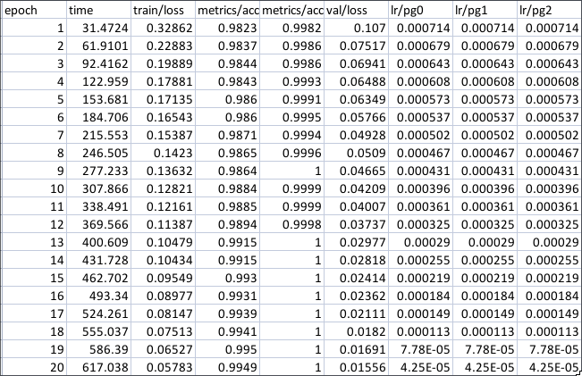
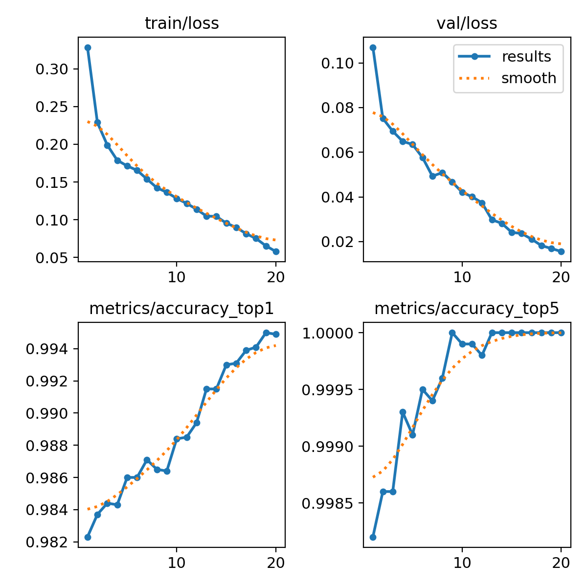
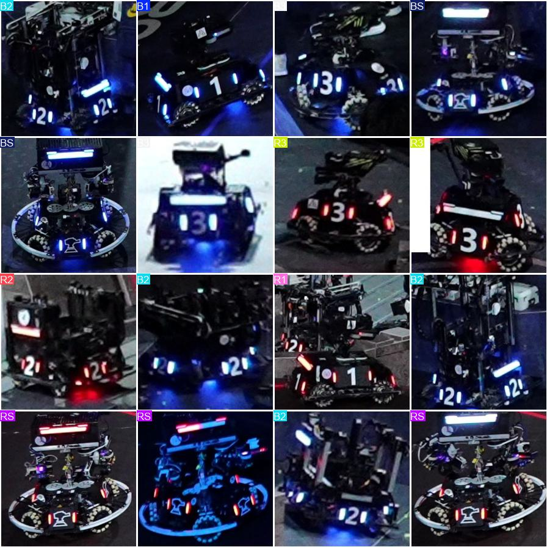
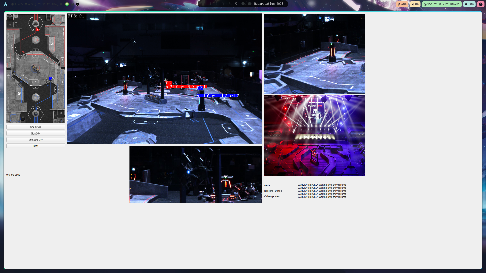

# RoboMaster 雷达

---

机器人识别与分类

<!--v-->

## 相关贡献

1. 叶畅飞： 训练程序 + 最后演示程序
2. 金思睿： 训练UI设计 + 程序编写
3. 郑诚： 数据集整理 + 文档编写 

<div style="display: flex; justify-content: center;">
   
</div>


<!--v-->
1. 背景介绍
2. 代码分析
3. 模型评价
4. 模型展示

<!--s-->

## Part 1 背景介绍

  <div class="divmomentum">
      <iframe class="iframemomentum" src="https://www.robomaster.com" scrolling="no" ></iframe>
  </div>

  <style>
  .divmomentum {
      position: relative;
      width: block;
      height: 800px;
      overflow: hidden;
  }

  .iframemomentum {
      position: absolute;            
      top: -165px;
      left: 0px;
      width: 1600px;
      height: 1400px;
  }
  </style>

<!--v-->

### Part 1.2 雷达

<div style="display: flex; align-items: center;">

  
  <div style="width: 1200px;text-align:left">
    雷达可自主获取战场信息，并通过多机通信向己方机器人或裁判系统选手端发送信息。<br>
    <br>
    赛场上常通过工业相机获取视野+激光雷达测距的方案来对全场机器人进行定位标记。
    <br>
  </div>
</div>
<!--v-->

### Part 1.3 模型需求

- 为了能认出相机获取到的图片中的机器人信息，本方案采用了双层模型，第一层识别整图中的机器人，采用 detect 模型提取出 roi，交给第二层的 classify 模型分类车辆，从而实现对全场机器人的检测。

- 本报告讲解第二层分类网络的实现与应用。

<!--s-->

## Part2 代码分析

<!--v-->

### 手工定义训练网络

```python [1|28|66-67]
class ResBlock(nn.Module):
    def __init__(self, inchannel, outchannel, stride=1):
        super(ResBlock, self).__init__()

        self.block = nn.Sequential(4
            nn.Conv2d(inchannel, outchannel, kernel_size=3, stride=stride, padding=1, bias=False),
            nn.BatchNorm2d(outchannel),
            nn.ReLU(inplace=False),
            nn.Conv2d(outchannel, outchannel, kernel_size=3, stride=1, padding=1, bias=False),
            nn.BatchNorm2d(outchannel)
        )

        self.shortcut = nn.Sequential()
        if stride != 1 or inchannel != outchannel:
            self.shortcut = nn.Sequential(
                nn.Conv2d(inchannel, outchannel, kernel_size=1, stride=stride, bias=False),
                nn.BatchNorm2d(outchannel)
            )

    def forward(self, x):

        out = self.block(x)
        out = out + self.shortcut(x)
        out = F.relu(out, inplace=False)

        return out

class ResNet(nn.Module):
    def __init__(self, block, num_blocks, num_classes=10):

        super(ResNet, self).__init__()
        self.inchannel = 64
        self.conv1 = nn.Sequential(
            nn.Conv2d(3, 64, kernel_size=3, stride=1, padding=1, bias=False),
            nn.BatchNorm2d(64),
            nn.CELU(alpha=0.075, inplace=False)
        )
        self.layer1 = self.make_layer(block, 64, num_blocks[0], stride=1)
        self.layer2 = self.make_layer(block, 128, num_blocks[1], stride=2)
        self.layer3 = self.make_layer(block, 256, num_blocks[2], stride=2)
        self.layer4 = self.make_layer(block, 512, num_blocks[3], stride=2)
        self.fc = nn.Linear(512, num_classes)

    def make_layer(self, block, channels, num_blocks, stride):
        strides = [stride] + [1] * (num_blocks - 1)
        layers = []
        for stride in strides:
            layers.append(block(self.inchannel, channels, stride))
            self.inchannel = channels
        return nn.Sequential(*layers)

    def forward(self, x):

        out = self.conv1(x)
        out = self.layer1(out)
        out = self.layer2(out)
        out = self.layer3(out)
        out = self.layer4(out)
        #out = F.avg_pool2d(out, 4)
        out = F.adaptive_avg_pool2d(out, (1, 1))

        out = out.view(out.size(0), -1)
        out = self.fc(out)
        return out

def ResNet18():
    return ResNet(ResBlock, [2, 2, 2, 2])

```

<!--v-->

### 训练 U I 展示



<!--v-->

### 采用 yolo v11m 预训练网络



<!--v-->

### Albumentation 数据增强

```python [1 | 3-16]
import albumentations as A

T = [
    A.RandomBrightnessContrast(brightness_limit=0.3, contrast_limit=0.3, p=0.7),
    A.RGBShift(r_shift_limit=20, g_shift_limit=20, b_shift_limit=20, p=0.5),
    A.HueSaturationValue(hue_shift_limit=10, sat_shift_limit=30, val_shift_limit=20, p=0.5),
    A.MotionBlur(blur_limit=13, p=0.5),
    A.OneOf([
        A.GaussianBlur(blur_limit=3),
        A.MedianBlur(blur_limit=3),
    ], p=0.5),

    A.RandomGamma(p=0.0),
    A.GaussianNoise(var_limit=(10.0, 50.0), p=0.4),
     A.ISONoise(color_shift=(0.01, 0.05), intensity=(0.1, 0.5), p=0.6),
]
```

<!--s-->

## 模型评价

<!--v-->

### 自定义评价函数

```python [1-10 | 13-31 | 33-52]
def plot_training_history(history: dict[str, list[float]], title : str="Training History"):
    """
    绘制训练历史曲线

    参数:
        history: 包含训练历史的字典
        title: 图表标题
    """

    ...


def plot_roc_curve(
    model : torch.nn.Module,
    test_loader:torch.utils.data.DataLoader[tuple[torch.Tensor, Any]],
    classes:dict[int, str],
    device: Optional[torch.device] =None,
    title: str = "Multiclass ROC Curve"
):
    """
    绘制多分类ROC曲线

    参数:
        model: 要评估的模型
        test_loader: 测试数据加载器
        classes: 类别名称列表
        device: 使用的设备
        title: 图表标题
    """

    ...

def model_evaluate(
    model : torch.nn.Module,
    test_loader:torch.utils.data.DataLoader[tuple[torch.Tensor, Any]],
    classes:dict[int, str],
    device: Optional[torch.device] =None,
):
    if device is None:
        device = torch.device('cuda:0' if torch.cuda.is_available() else 'cpu')
    model = model.to(device)

    """
    评估模型在测试集上的性能
    参数:
        model: 要评估的模型
        test_loader: 测试数据加载器
        classes: 类别名称列表
        device: 使用的设备
    """

    ...
```

<!--v-->

### ROC 曲线

数据集过大不易训练，故采用中药数据集进行示例展示

方框是因为没有给 matplotlib 做中文适配


<!--v-->

### Ultralytics 模型评价展示

<!--v-->



<!--v-->
<div style="display: flex; align-items: center;">
  
  
</div>

<!--s-->

## 模型展示


